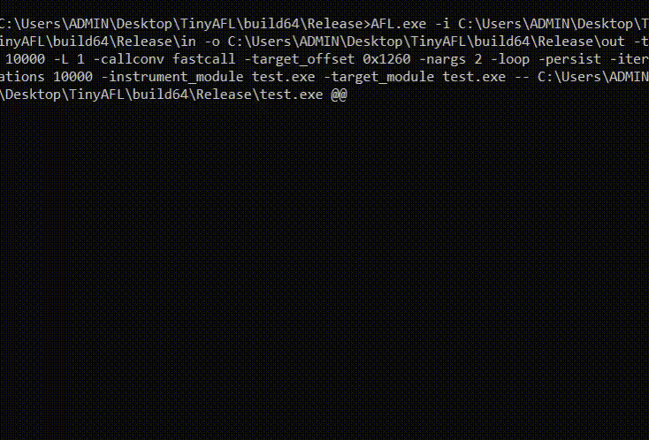

# TinyAFL (MacOS)

Release Version: 1.0

TinyAFL is built on top of AFL and [TinyInst](https://github.com/googleprojectzero/TinyInst).

It can be fuzz on MacOS user-mode application without source but it is not so reliable and dirty. It has quite a few limitations. It works unstable and often crashes due to some memory errors.

## Contents
  1. [Features](#features-of-tinyafl)
  2. [How to compile TinyAFL](#building-tinyafl)
  3. [How to fuzz a target](#how-to-fuzz-with-tinyafl)

## Features of TinyAFL
TinyAFL works similarly to AFL. However I use TinyInst for coverage. More about TinyInst can be found [here](https://github.com/googleprojectzero/TinyInst/blob/0bf83dc45fc14c43c7bf165a91820b92e5565add/README.md).

<p align="center">

</p>

## Building TinyAFL
1. Open a terminal and set up your build environment
2. Navigate to the directory containing the source
3. Run the following commands (change the generator according to the version of IDE and platform you want to build for):
#### MacOS
```
mkdir build 
cd build 
cmake -G Xcode .. 
cmake --build . --config Release
```
## How to fuzz with TinyAFL
The command line for TinyAFL:
```
./AFL [ afl options ] -- target_cmd_line
```
The following TinyAFL options are supported:
```
Required parameters:

  -i dir        - input directory with test cases
  -o dir        - output directory for fuzzer findings

Execution control settings:

  -f file       - location read by the fuzzed program (stdin)
  -t msec       - timeout for each run (auto-scaled, 50-1000 ms)
  -m megs       - memory limit for child process (50 MB)

Fuzzing behavior settings:

  -x dir        - optional fuzzer dictionary (see README)

Other stuff:

  -M / -S id    - distributed mode (see parallel_fuzzing.txt)
  -e ext        - file extension for the fuzz test input file (if needed)

tiny-afl settings:

  -instrument_module path       - path to instrumented PE
```
To see the supported instrument flags, please refer to the mode-specific documentation at TinyInst
#### Example command TinyAFL 
```
AFL -i in -o out -t 10000 -target_offset 0x1260 -nargs 2 -loop -persist -iterations 10000 -instrument_module test -target_module test -- test @@
```
#### Minimize testcase
```
./afl-tmin [ options ] -- /path/to/target_app [ ... ]

Required parameters:

  -i file       - input test case to be shrunk by the tool
  -o file       - final output location for the minimized data
  -instrument_module module     - target module to test

Execution control settings:

  -t msec       - timeout for each run (1000 ms)
```
## Special Thanks
Special thanks to Ivan Fratric "[ifsecure](https://twitter.com/ifsecure)" and [Alexandru-Vlad Niculae](https://twitter.com/_aniculae) security researcher of Google Project Zero has published a great tool for coverage-guided
